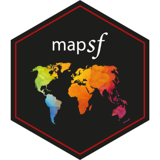
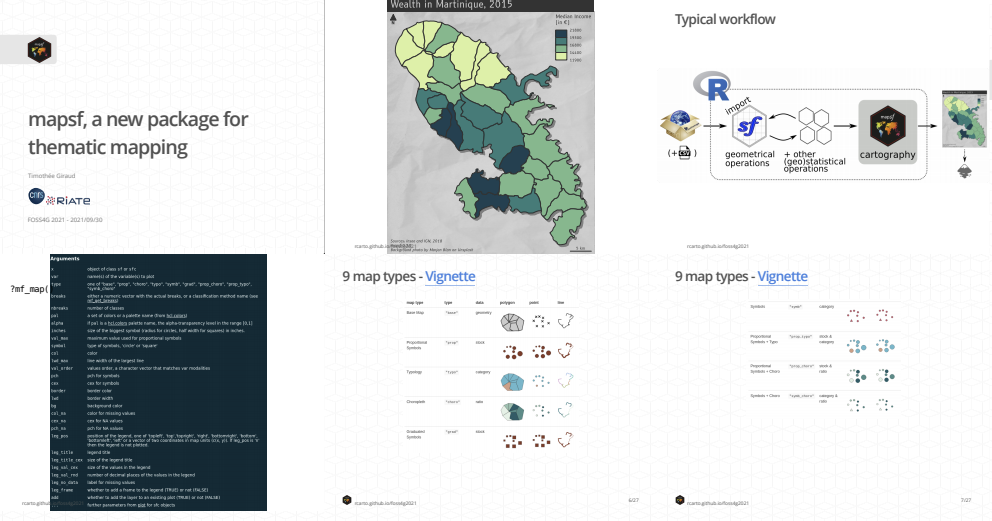

## [`mapsf`, a new package for thematic mapping](https://rcarto.github.io/foss4g2021/) 

**Timothée Giraud** - CNRS     
**[FOSS4G 2021](https://2021.foss4g.org/) - 2021/09/30**  

## [Slides](https://rcarto.github.io/foss4g2021/)

## [Abstract](https://callforpapers.2021.foss4g.org/foss4g2021/talk/Z8M7XW/)

The R software spatial ecosystem is rich, dynamic and mature and several R packages allow to leverage the power of major FOSS libraries (like GDAL,GEOS or PROJ) for spatial data management.
`mapsf` takes advantage of this ecosysem to create and integrate thematic maps in R workflows. It helps designing various cartographic representations such as proportional symbols, choropleth or typology maps. It also offers several functions to display layout elements improving the graphic presentation of maps (e.g. scale bar, north arrow, title, labels). This talk will present the main features of the package and demonstrate how to use it to design high quality maps.

`mapsf` [1] helps designing various cartographic representations such as proportional symbols, choropleth or typology maps. It also offers several functions to display layout elements improving the graphic presentation of maps.
The aim of mapsf is to obtain thematic maps with the visual quality of those built with a classical mapping or GIS software while being lightweight, versatile and user-friendly. To achieve this goal, the package takes advantage of the features offered by `sf` [2] and provides a limited number of simple mapping functions.

`mapsf` is the successor of `cartography` [3], it offers the same core features but it is simpler and more robust. Unlike other popular cartographic packages, it does not use grammar of graphics, it depends on a limited number of packages and displays georeferenced plots using base R graphics.

The main function of the package, `mf_map()`, gives access to 9 map types: base maps, proportional or graduated symbols, choropleth maps, typology maps and various combinations of symbology. Many parameters are available to fine tune the cartographic representations. These parameters are the common ones found in GIS and automatic cartography tools (e.g. classification, color palettes, symbols sizes, legend layout...).
Some additional functions are dedicated to layout design (graphic themes, legends, scale bar, north arrow, title, credits…), map insets or map exports.

The development of `mapsf` follows the current best practices of the R ecosystem (CI/CD, coverage tests) and its documentation is enhanced by several vignettes (the classic form of detailed documentation for R packages) and a website.

* [Package repository on GitHub](https://github.com/riatelab/mapsf)  
* [Package website](https://riatelab.github.io/mapsf/)  

[1] Timothée Giraud (2021). mapsf: Thematic Cartography. R package version 0.3.0. https://CRAN.R-project.org/package=mapsf    
[2] As stated by its authors, sf offers a "support for simple features, a standardized way to encode spatial vector data. Binds to 'GDAL' for reading and writing data, to 'GEOS' for geometrical operations, and to 'PROJ' for projection conversions and datum transformations."  
Pebesma, E., 2018. Simple Features for R: Standardized Support for Spatial Vector Data. The R Journal 10 (1), 439-446, https://doi.org/10.32614/RJ-2018-009    
[3] Giraud, T. and Lambert, N. (2017). “Reproducible Cartography.” In Peterson M. (ed.), Advances in Cartography and GIScience. ICACI 2017. Lecture Notes in Geoinformation and Cartography._, pp. 173-183. https://doi.org/10.1007/978-3-319-57336-6_13
